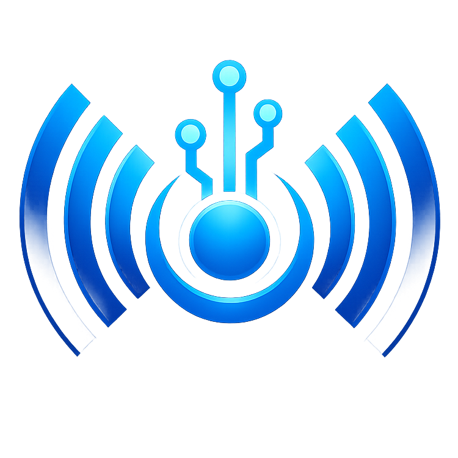

<h1 align="center">Signal Menu</h1>

  

A fork of ii's Stupid Menu with **252 safety patches** for anti-ban protection. Built on top of the full ii's menu codebase with **2100+ mods**.

---

## About

Signal Menu adds a protection layer on top of ii's Stupid Menu. All the original mods are included, plus patches that spoof your identity, block telemetry, and bypass anti-cheat systems.

  
<b>What's different from ii's menu?</b>

Signal Menu includes 252 safety patches that ii's menu doesn't have:

- **Identity Spoofing** - HWID, PlayFabID, DeviceUniqueIdentifier, SystemInfo fields
- **Telemetry Blocking** - GorillaTelemetry, PlayFab, Mothership, Backtrace
- **Anti-Cheat Bypass** - MonkeAgent (17 methods), GracePeriod, ShouldDisconnect
- **Stealth** - Assembly hiding, process hiding, stack trace sanitization
- **Network Safety** - Event filtering, property sanitization, disconnect prevention
- **File Protection** - Debug log filtering, BepInEx hiding

  
<b>Can I use your code?</b>

Yes, but GPL-3.0 rules apply:
- Your project must also be open-source
- Give credit to Signal Menu and ii's Stupid Menu
- Follow the [GPL-3.0 License](https://www.gnu.org/licenses/gpl-3.0.html)

  
<b>Installation</b>

1. Download the latest release
2. Put `SignalMenu.dll` in your BepInEx/plugins folder
3. Launch Gorilla Tag

---

## Build From Source

1. Clone or download the source code
2. Edit `Directory.Build.props` and set `<GorillaTagDir>` to your Gorilla Tag install path
3. Build with `Ctrl + Shift + B` in Visual Studio or run `dotnet build`

The DLL will be in `bin/Debug/netstandard2.1/SignalMenu.dll`

---

  
<b>System Compatibility</b>

| Operating System | Status |
|------------------|--------|
| Windows 10 | Full Support |
| Windows 11 | Full Support |
| Mac OS | Works (limited) |
| Linux (Proton) | Works |

  
<b>Headset Compatibility</b>

| Headset | Status |
|---------|--------|
| Quest 1/2/3/Pro | Supported |
| Rift / Rift S | Supported |
| Valve Index | Supported |
| Pico 4 | Supported |
| Other PCVR | Supported |

---

## Credits

- [iiDk](https://github.com/iiDk-the-actual) - Original ii's Stupid Menu
- [Goldentrophy Software](https://goldentrophy.software) - Original menu development

---

> This product is not affiliated with Gorilla Tag or Another Axiom LLC and is not endorsed or otherwise sponsored by Another Axiom LLC. Portions of the materials contained herein are property of Another Axiom LLC.
>
> Use at your own risk. No mod menu can guarantee 100% safety.
>
> Signal Menu  
> Copyright (C) 2026  
> This program is free software under the GNU General Public License v3.0
